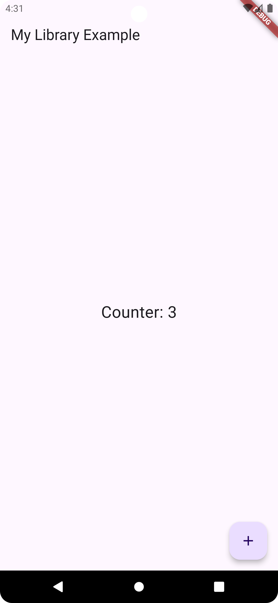

# My State Management

A lightweight and flexible state management library for Flutter, designed to simplify managing both simple and complex application states.

## Features

- **Easy Initialization**: Quickly set up states with default values.
- **Reactive Updates**: Automatically rebuild widgets when related state changes.
- **Asynchronous Support**: Manage states with async operations like API calls.
- **Memory Efficient**: Dispose states when they are no longer needed.
- **Supports Nested Structures**: Manage nested data with ease.
- **Performance-Oriented**: Optimized to avoid unnecessary renders.

## Screenshot

|              Screenshot on Android              |
|:-----------------------------------------------:|
|  |

## Getting started

### Adding package
To get started with the library, add it to your `pubspec.yaml`:

```yaml
dependencies:
  my_state_management:
    path: ../ 
```

### Importing package

Then import it in your Dart file:

```dart
import 'package:my_state_management/my_state_management.dart';
```
## Usage

### Initialize a state
```dart
final StateProvider stateProvider = StateProvider();

stateProvider.initialize<int>('counter', 0);
```

### Access a state
```dart
final counterState = stateProvider.getState<int>('counter');
```

### Update a state
```dart
stateProvider.update<int>('counter', counterState?.value ?? 0 + 1);
```

### Reset a state
```dart
stateProvider.reset('counter', 0);
```

## Test:
```dart
import 'package:flutter_test/flutter_test.dart';

import 'package:my_state_management/my_state_management.dart';

void main() {
  test('ReactiveState should update correctly', () {
    final state = ReactiveState<int>(0);
    state.update(1);
    expect(state.value, 1);
  });

  test('StateProvider should initialize and update state correctly', () {
    final stateProvider = StateProvider();
    stateProvider.initialize<int>('counter', 0);
    final counterState = stateProvider.getState<int>('counter');
    expect(counterState?.value, 0);

    stateProvider.update<int>('counter', 5);
    expect(counterState?.value, 5);
  });
}
```


## Full example:
```dart
import 'package:flutter/material.dart';
import 'package:my_state_management/my_state_management.dart';

void main() {
  runApp(const MyApp());
}

class MyApp extends StatelessWidget {
  const MyApp({super.key});

  @override
  Widget build(BuildContext context) {
    return const MaterialApp(
      title: 'Example App',
      home: CounterScreen(),
    );
  }
}

class CounterScreen extends StatefulWidget {
  const CounterScreen({super.key});

  @override
  _CounterScreenState createState() => _CounterScreenState();
}

class _CounterScreenState extends State<CounterScreen> {
  final StateProvider _stateProvider = StateProvider();

  @override
  void initState() {
    super.initState();
    _stateProvider.initialize<int>('counter', 0); // Initialize state
  }

  @override
  Widget build(BuildContext context) {
    final counterState = _stateProvider.getState<int>('counter');

    return Scaffold(
      appBar: AppBar(title: const Text('My Library Example')),
      body: Center(
        child: StreamBuilder<int>(
          stream: counterState?.stream,
          initialData: counterState?.value,
          builder: (context, snapshot) {
            final counter = snapshot.data ?? 0;
            return Text(
              'Counter: $counter',
              style: const TextStyle(fontSize: 24),
            );
          },
        ),
      ),
      floatingActionButton: FloatingActionButton(
        onPressed: () {
          final currentCounter = counterState?.value ?? 0;
          _stateProvider.update<int>(
              'counter', currentCounter + 1); // Update state
        },
        child: const Icon(Icons.add),
      ),
    );
  }
}

```

## Additional information
- For more details, visit the [documentation](https://dart.dev/tools/pub/writing-package-pages).
- Contributions are welcome! To contribute, submit a pull request or reach out to us on GitHub.